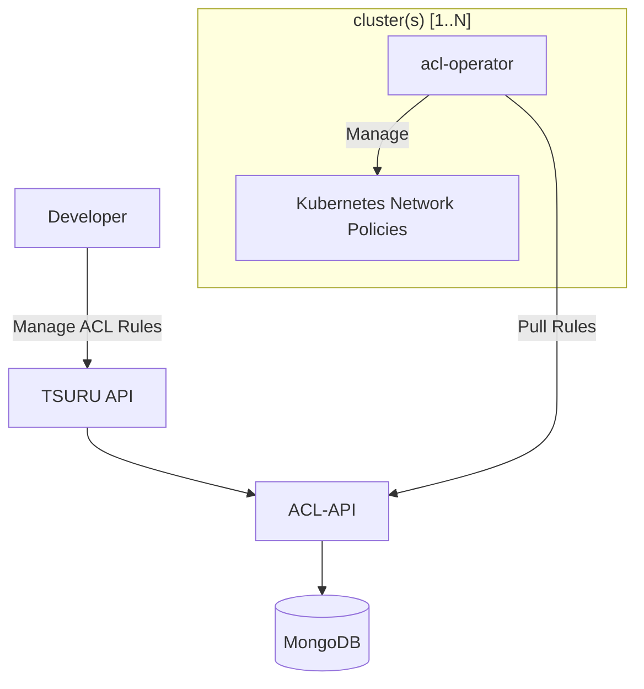

# acl-api
API that stores rules of network to be consumed by acl-operator

# Architecture

# concepts

## rule

Rule is a dynamic target that tsuru application connect into, rule can  translated into a firewall rules or kubernetes network policies delegating capacity to the drivers, the responsability of acl-api is to store these rules and serve as a source of truth of all network permissions.

## service instance

Tsuru API provides a contract to extend app with other apis, acl-api used this generic resource to gather many rules into one shareable resource, it means that you can add many rules into a service instance, and bind it service instance to many apps.

# artifacts

- [Docker Hub Repository](https://hub.docker.com/r/tsuru/acl-api)
