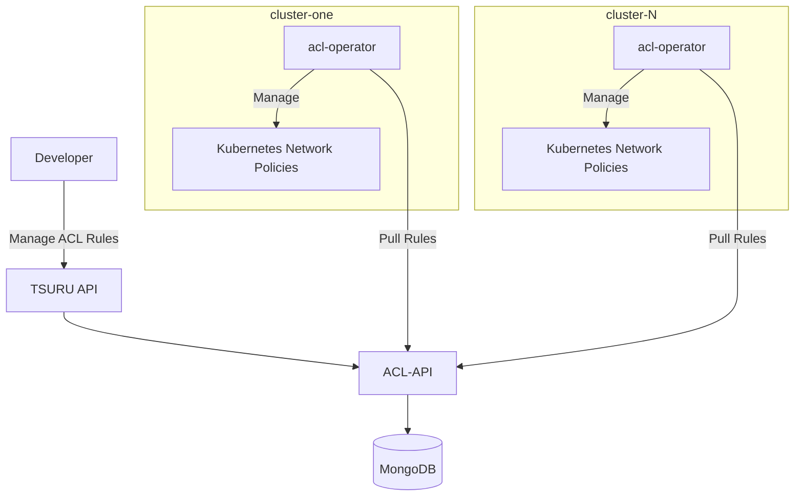

# acl-api
API that stores rules of network to be consumed by acl-operator

# Architecture 

```mermaid
graph TD;
    developer[Developer];
    tsuru[TSURU API];
    aclapi[ACL-API];
    mongodb[(MongoDB)];
    acl-operator1[acl-operator];
    acl-operator2[acl-operator];
    network-policies1[Kubernetes Network Policies]
    network-policies2[Kubernetes Network Policies]


    developer -- Manage ACL Rules --> tsuru;
    tsuru --> aclapi;
    aclapi --> mongodb;
    acl-operator1 -- Pull Rules ----> aclapi
    acl-operator2 -- Pull Rules ----> aclapi
    
    click tsuru "https://www.github.com/tsuru/tsuru" "Access github project"
    click aclapi "https://www.github.com/tsuru/acl-api" "Access github project"

    click acl-operator1 "https://www.github.com/tsuru/acl-operator" "Access github project"
    click acl-operator2 "https://www.github.com/tsuru/acl-operator" "Access github project"
    
    click network-policies1 "https://kubernetes.io/docs/concepts/services-networking/network-policies/" "Read more about kubernetes network policies"
    click network-policies2 "https://kubernetes.io/docs/concepts/services-networking/network-policies/" "Read more about kubernetes network policies"

    subgraph cluster-one
      acl-operator1 -- Manage --> network-policies1
    end
    
    subgraph cluster-N
      acl-operator2 -- Manage --> network-policies2
    end

```
